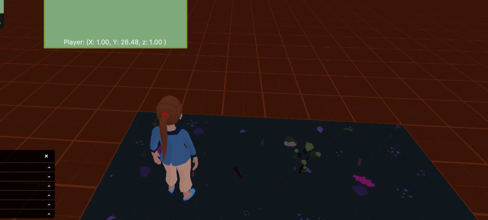

# Dogman's Awesome Repository

Welcome to Dogman's Awesome repository!

This is a large collection of example scenes, mechanics, and full tutorials meant to help you build scenes for Decentraland!

  
Content Index

 
#### [ Essentials](#essentials)
- [Full Games](#full-games)
- [Game Mechanics](#game-mechanics)
- [Event Hosting](#event-hosting)
- [Wearables](#wearables)
#### [ Full Scenes](#full-scenes)
- [Public Scenes](#public-scenes)
#### [ Tutorials](#tutorials)
- [Video tutorials](#video-tutorials)

 

 
<!--
## FAQs

[Read the FAQs](https://github.com/decentraland-scenes/Awesome-Repository/blob/master/FAQ.md)

Check the Forum
Visit the Discord channel

-->

## Key Concepts

For a fully comprehensive introduction, we recommend you read the following topics from the Documentation:

- [Entities & Components](https://docs.decentraland.org/creator/development-guide/sdk7/entities-components/)
- [Systems](https://docs.decentraland.org/creator/development-guide/sdk7/systems/)
- [Custom Components](https://docs.decentraland.org/creator/development-guide/sdk7/custom-components/)
- [Querying Component](https://docs.decentraland.org/creator/development-guide/sdk7/querying-components/)
- [Files in a Scene](https://docs.decentraland.org/creator/development-guide/sdk7/scene-files/)

See the [Decentraland documentation](https://docs.decentraland.org/creator) to find more specific information about various other.

## Examples

### Essentials

#### Full Games

| Example                                                                          | Thumbnail                                                  | Description                                                                                                                                                                                                                                         |
| -------------------------------------------------------------------------------- | ---------------------------------------------------------- | --------------------------------------------------------------------------------------------------------------------------------------------------------------------------------------------------------------------------------------------------- |
| [FluffyCat (sdk7)](https://github.com/dogmandcl/fluffyCat)              |        | An Endless Runner Game where you play as a cat avoiding obstacles and hunting birds for bonus points!                                                                                                  |
| [SugarClub Drinking Game (sdk6)](https://github.com/toosad/drinking-game)              |        | A metaverse drinking game where more drinks impair the users vision.

<!-- #### Game Mechanics

| Example                                                                                                       | Thumbnail                                                          | Description                                                                                                                                                                                        |
| ------------------------------------------------------------------------------------------------------------- | ------------------------------------------------------------------ | -------------------------------------------------------------------------------------------------------------------------------------------------------------------------------------------------- | -->
<!-- | [Atari Arcade Cabinets](https://github.com/decentraland-scenes/atari-arcade-cabinets)                         |       | Arcade cabinets containing variations of the classic Breakout game.                                                                                                                                | -->

#### Event Hosting

| Example                                                                                             | Thumbnail                                               | Description                                                                                                                     |
| --------------------------------------------------------------------------------------------------- | ------------------------------------------------------- | ------------------------------------------------------------------------------------------------------------------------------- |
| [Wearable Token Gate](https://github.com/dogmandcl/tokenGateSDK7)                           |            | Updated token gate that check for multiple wearables and has different triggers. |
| [AutoDance Areas](https://github.com/dogmandcl/autoDance)                           |            | creates auto dance areas with custom emotes!. |
| [Block Smart Wearables](https://github.com/dogmandcl/blockPortableEXP)                           |            | Block Smart Wearables  |
| [Bouncer UI ](https://github.com/dogmandcl/bouncerUI)                           |            | Allows players to set admins who can teleport players off their land and make announcements |
| [Lazy Loading ](https://github.com/dogmandcl/LazyLoading)                           |            | Load optimaztion triggered 
#### Wearables 

| Example                                                                             | Thumbnail                                                | Description                                                                                                                           |
| ----------------------------------------------------------------------------------- | -------------------------------------------------------- | ------------------------------------------------------------------------------------------------------------------------------------- |
| [Weathernator 3000](https://github.com/dogmandcl/buildWearable)                        |    |Smart wearable that allows users to check and mimic the weather of different major cities. Code is open source and free to use. Models are not to be used for profit in any form. |   
| [Flying Wearable](https://github.com/dogmandcl/Flying-Wearable-DCL)                        |    |Smart wearable that allows users to fly upward                                                                    |
                                                                  

<!-- 
### Full Scenes

#### Public Scenes

| Example                                                                                                   | Thumbnail                                                     | Description                                                                                                                                                                          |
| --------------------------------------------------------------------------------------------------------- | ------------------------------------------------------------- | ------------------------------------------------------------------------------------------------------------------------------------------------------------------------------------ | -->
<!-- | [Crypto Valley Conference Center](https://github.com/decentraland-scenes/crypto-valley-conference-center) |      | A fully equipeped venue ready for live events, with video streaming and POAP dispenser.                                                                                              | -->

## Tutorials

### Video tutorials

Find a full playlist of all Decentraland video tutorials here:

[Youtube Playlist](https://www.youtube.com/playlist?list=PLAcRraQmr_GPi-8qgv17ewdGl50OHuOhH) |
[SDK6 Starter Video](https://www.youtube.com/watch?v=rOs6-QHOYx4&t=127s) |
[Smart Wearable Starter Video](https://www.youtube.com/watch?v=5-obkL_Fzxg&t=265s)

## Copyright info

All of these scenes are open source, protected with a standard Apache 2 licence. This licence states that this content can be used freely, even commercially, as long as you acknowledge the author. See the terms and conditions in the [LICENSE](/LICENSE) file.